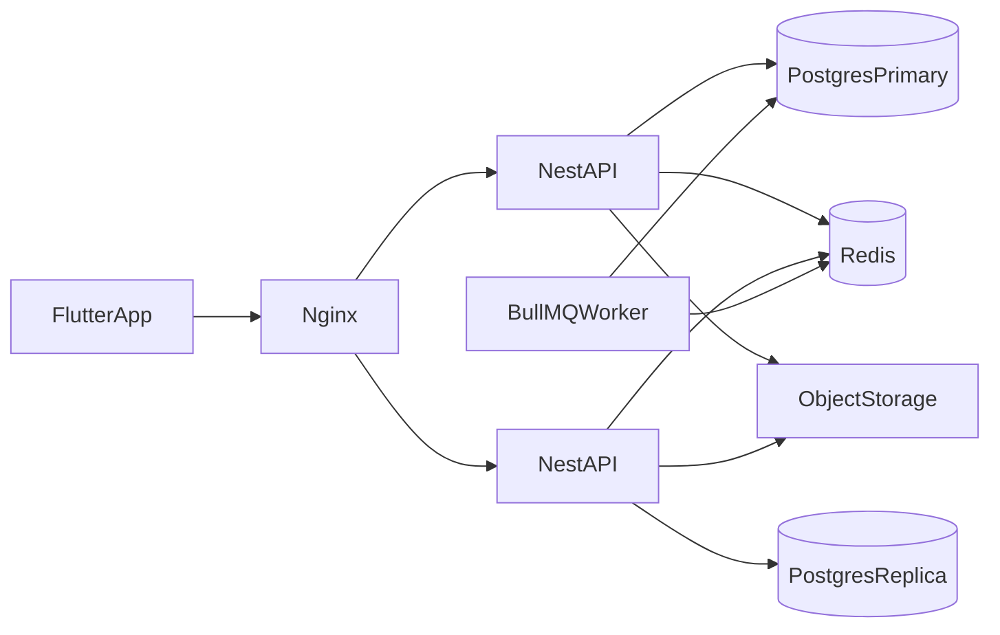

# InternFinder — Architecture

แบบระบบของแอปฝึกงาน InternFinder ยึด [REQUIREMENTS.md](REQUIREMENTS.md) เป็นขอบเขตฟีเจอร์ รายละเอียดตารางอยู่ใน [DATABASE.md](DATABASE.md)

สถานะตอนนี้ในรีโปคือสแคฟโฟลด์: NestJS ที่ `server/src` และ Flutter ที่เปิด `HomeScreen` ตรงจาก `client/lib/main.dart` เอกสารนี้คือแบบที่โค้ดใหม่ต้องเดินตาม

## 1. ภาพรวม

แอปมือถือ Flutter เรียก REST API ของ NestJS ผ่าน Nginx ตัว API ไม่เก็บ session และไม่เก็บไฟล์บนดิสก์ของตัวเอง

- ข้อมูลจริงอยู่ใน PostgreSQL
- Resume PDF และ logo อยู่ใน MinIO
- Redis ใช้เป็น cache, คิว, pub/sub และล็อกระยะสั้น
- HTTP adapter คือ Express ไม่ใช้ Fastify
- สัญญาของ API คือ Swagger ที่ `GET /api/docs`



เครื่องพัฒนาใน `docker-compose.yml` รัน API, PostgreSQL, Redis และ MinIO อย่างละหนึ่งตัว Production profile เพิ่ม Nginx, PostgreSQL replica และ Redis หลายโหนด โค้ดใช้ TypeORM replication กับ JWT ที่ไม่ผูกเครื่อง ดังนั้นเพิ่มอินสแตนซ์ได้โดยไม่เปลี่ยนกติกาธุรกิจ

Read ของ job feed ชี้ replica Write ทุกชนิดชี้ primary

## 2. ทำไมใช้ Express

ใช้ `@nestjs/platform-express` ที่มีอยู่ใน `server/package.json` แล้ว Swagger ใน `server/src/main.ts` ทำงานบน Express อยู่แล้ว

- อัปโหลด Resume และ logo ใช้ `FileInterceptor` กับ multipart ซึ่งเป็นเส้นทางมาตรฐานของ NestJS บน Express
- Bull Board และ `@nestjs/terminus` เข้ากับ Express โดยไม่ต้องเขียนอะแดปเตอร์เพิ่ม
- คอขวดของแอปนี้อยู่ที่ PostgreSQL, Redis และไฟล์ ไม่ได้อยู่ที่ตัวรับ HTTP

ไม่ย้ายไป `@nestjs/platform-fastify`

## 3. Swagger

คง OpenAPI ที่ `GET /api/docs` เอกสารต้องตรงกับ route จริง ชื่อเอกสารคือ InternFinder API และมี Bearer auth

- แยก tag ตามโมดูล: Auth, Students, Companies, Jobs, Applications, Notifications, Health
- DTO ทุกตัวมี `@ApiProperty` รวม enum และฟิลด์ที่ required
- endpoint ทุกตัวมี `@ApiOperation` และ `@ApiResponse` ของสถานะที่ใช้จริง เช่น 200, 201, 400, 401, 403, 409
- endpoint ที่ต้อง login มี `@ApiBearerAuth`
- อัปโหลด Resume และ logo ระบุว่าเป็น `multipart/form-data`
- ฝั่ง Flutter เรียกเฉพาะเส้นทางที่มีใน Swagger นี้

Prefix ของ API คือ `/api` ตาม `app.setGlobalPrefix('api')` ใน `server/src/main.ts`

## 4. โมดูล NestJS

โมดูลละหนึ่งขอบเขตธุรกิจ ไม่มีโมดูล Admin

| โมดูล | หน้าที่ |
|---|---|
| AuthModule | สมัคร, login, refresh, logout |
| StudentsModule | โปรไฟล์นักศึกษาและ Resume |
| CompaniesModule | โปรไฟล์บริษัท, logo, ตัวเลขแดชบอร์ด |
| JobsModule | ประกาศ, feed, บันทึกงาน, เปิดหรือปิดรับสมัคร |
| ApplicationsModule | สมัครงาน, timeline, เปลี่ยนสถานะ |
| NotificationsModule | แจ้งเตือนในแอปและ BullMQ worker |
| StorageModule | พอร์ตเก็บไฟล์ ตัวจริงคือ MinIO |
| HealthModule | liveness และ readiness |

Controller บาง: รับ DTO, เรียก service, คืนค่า ไม่ใส่กติกาธุรกิจใน controller

Service ถือกติกา เช่น สมัครได้ครั้งเดียว, ทางเดินสถานะ, บริษัทเห็นเฉพาะงานของตัวเอง

Repository เป็น Data Mapper ใช้คลาส repository ที่ฉีดเข้า service ห้ามให้ entity เรียก `.save()` เองแบบ Active Record

Dependency injection เป็น singleton เป็นค่าเริ่มต้น ไม่ใช้ request scope เพราะทำให้ dependency ทั้งสายกลายเป็นต่อ request ผู้ใช้ปัจจุบันมาจาก `JwtAuthGuard` ผ่าน `@CurrentUser()` Custom provider ใช้กับ storage driver และค่า TTL ของ cache

Validation เป็น global `ValidationPipe` แบบ `whitelist`, `forbidNonWhitelisted`, `transform` แยก DTO ของการสร้างงาน, แก้งาน, ค้นหา feed, สมัครงาน และเปลี่ยนสถานะ

เทสใช้ Vitest กับ `@nestjs/testing` mock repository แบบ Arrange, Act, Assert เคสขั้นต่ำคือสมัครซ้ำ, เปลี่ยนสถานะข้ามขั้น, และบริษัทเห็นเฉพาะผู้สมัครของตัวเอง

โครงโฟลเดอร์เป้าหมาย:

```text
server/src/
├── main.ts
├── app.module.ts
├── common/
│   ├── decorators/
│   ├── filters/
│   ├── guards/
│   └── interceptors/
├── config/
├── database/
│   └── migrations/
├── auth/
├── students/
├── companies/
├── jobs/
├── applications/
├── notifications/
├── storage/
└── health/
```

แต่ละโมดูลธุรกิจมี `*.module.ts`, `*.controller.ts`, `*.service.ts`, `*.repository.ts`, `dto/`, `entities/`

## 5. เส้นทาง API

Filter ของหน้า Home เป็น query ของ `GET /jobs` ไม่มี resource แยก

### Auth

| Method | Path | ใครเรียก |
|---|---|---|
| POST | /api/auth/register | ยังไม่ login |
| POST | /api/auth/login | ยังไม่ login |
| POST | /api/auth/refresh | มี refresh token |
| POST | /api/auth/logout | login แล้ว |

Register รับ email, password และ role `student` หรือ `company` role เปลี่ยนทีหลังไม่ได้

Access token อายุสั้น Refresh token หมุนทุกครั้งที่ใช้ และเก็บเป็นค่า hash Logout คือเพิกถอน refresh token

### นักศึกษา

| Method | Path | ใช้กับหน้า |
|---|---|---|
| GET, PATCH | /api/students/me | Student Profile |
| POST | /api/students/me/resume | Resume Upload |
| GET | /api/students/me/resume/file | Resume Preview / Download |
| GET | /api/jobs | Home / Job Feed |
| GET | /api/jobs/:id | Job Detail |
| POST, DELETE | /api/jobs/:id/save | Save จาก Job Detail |
| GET | /api/jobs/saved | Saved Jobs |
| POST | /api/jobs/:id/applications | Apply Job |
| GET | /api/applications | My Applications |
| GET | /api/applications/:id | Application Detail |
| GET | /api/notifications | Notifications |
| GET | /api/notifications/stream | ช่อง SSE ของแจ้งเตือน |

`GET /api/jobs` รับ `search`, `province`, `workMode`, `category`, `hasAllowance` และคืนเฉพาะงานสถานะ `open`

Route `GET /api/jobs/saved` ต้องประกาศก่อน `GET /api/jobs/:id` เพื่อไม่ให้คำว่า `saved` ถูกจับเป็น id

### บริษัท

| Method | Path | ใช้กับหน้า |
|---|---|---|
| GET | /api/companies/me/dashboard | Company Dashboard |
| GET, PATCH | /api/companies/me | Company Profile |
| POST | /api/companies/me/logo | อัปโหลด logo |
| GET, POST | /api/company/jobs | Manage Jobs, Create Job |
| GET, PATCH, DELETE | /api/company/jobs/:id | อ่าน แก้ หรือลบประกาศของบริษัทนี้ |
| PATCH | /api/company/jobs/:id/status | เปิดหรือปิดรับสมัคร |
| GET | /api/company/jobs/:id/applications | Applicants List |
| GET | /api/company/jobs/:id/applications/:applicationId | Applicant Detail |
| PATCH | /api/company/jobs/:id/applications/:applicationId/status | เปลี่ยนสถานะผู้สมัคร |

บริษัทเรียกได้เฉพาะประกาศและผู้สมัครของบริษัทตัวเอง ไม่เช่นนั้นตอบ 403

### Health

| Method | Path | ความหมาย |
|---|---|---|
| GET | /api/health/live | โปรเซสยังทำงาน |
| GET | /api/health/ready | ต่อ PostgreSQL และ Redis ได้ |

ใช้ `@nestjs/terminus` Nginx ใช้ readiness ก่อนส่งทราฟฟิก

## 6. Redis และคิว

ใช้ Redis เฉพาะจุดที่อ่านหนักหรือต้องกันการกดซ้ำ ไม่ cache สถานะใบสมัคร, แจ้งเตือน หรือ session

### Job feed เป็น cache-aside

คีย์รวม hash ของคำค้น, ตัวกรอง และเลขเวอร์ชันของ feed TTL ประมาณ 60 วินาทีบวก jitter เพื่อไม่ให้คีย์หมดอายุพร้อมกัน

ถ้า cache ไม่มี ใช้ `SET key NX EX` ให้ตัวเดียวไปอ่านฐานข้อมูล ตัวอื่นรอค่าที่ถูกเติม เป็นการกัน cache stampede

เมื่อสร้าง แก้ หรือปิดงาน ให้ `INCR jobs:feed:version` คีย์เก่าหลุดเองตาม TTL ไม่ลบคีย์ feed ทั้งก้อน

### แดชบอร์ดเป็น write-through

ตอนสร้างประกาศหรือมีใบสมัครใหม่ ให้ `INCR` ตัวเลขของบริษัทนั้นใน Redis คู่กับการเขียน PostgreSQL ถ้า Redis หาย ให้สร้างตัวเลขใหม่จากฐานข้อมูล แหล่งความจริงคือ PostgreSQL

### กันสมัครซ้ำ

`SET NX EX` ที่คู่ student กับ job กันการกดซ้ำข้ามอินสแตนซ์ Unique index ในฐานข้อมูลยังเป็นตัวตัดสินสุดท้าย

Redlock ใช้ล็อกชุดเดียวกันนี้เมื่อ production มี Redis หลายโหนด เครื่องพัฒนาใช้ Redis ตัวเดียว จึงใช้ `SET NX EX`

### แจ้งเตือนผ่าน outbox และ BullMQ

การเปลี่ยนสถานะ commit ทั้งใบสมัคร, timeline และแถว outbox ใน transaction เดียว Worker ของ BullMQ ค่อยสร้างแจ้งเตือน ถ้า Redis ล่มระหว่าง request แถว outbox ยังอยู่ใน PostgreSQL

- retry แบบ exponential backoff
- เกินจำนวนครั้งแล้วเข้า dead letter queue
- จำกัด concurrency และ rate ของ worker
- Bull Board เปิดในเครื่องพัฒนาสำหรับดูคิว

พอ worker เขียนแจ้งเตือนแล้ว publish Redis pub/sub ที่ช่องของ user นั้น API ทุกตัวที่ถือ SSE ของนักศึกษาคนนั้นส่งต่อได้โดยไม่ต้อง sticky session แหล่งความจริงที่หน้า Notifications ยังเป็น `GET /api/notifications` ไม่ใช้ push นอกแอป

## 7. กติกาที่อยู่ใน service

สมัครงานได้เมื่อนักศึกษามี Resume แล้ว งานยัง `open` และยังไม่เคยสมัครงานนี้ ใบสมัครใหม่ได้สถานะ `submitted` พร้อม event แรก

ทางเดินสถานะมีทิศทางเดียว

```text
submitted → reviewing → accepted
                      → rejected
```

`accepted` และ `rejected` เปลี่ยนต่อไม่ได้ ทุกครั้งที่บริษัทเปลี่ยนสถานะ นักศึกษาได้แจ้งเตือนหนึ่งรายการ

รายละเอียด lock และ transaction อยู่ใน [DATABASE.md](DATABASE.md)

## 8. Flutter

ใช้ Material 3 จาก [client/lib/core/theme/app_theme.dart](../client/lib/core/theme/app_theme.dart) ไม่ลง `shadcn_ui` เพราะชุดนั้นเป็นคนละ design system และทับธีมที่มีอยู่ หน้าลิสต์ ฟอร์ม Bottom Sheet และแถบนำทางใช้ widget ของ Material

แพ็กเกจที่ลงใน `client/pubspec.yaml`

- `flutter_riverpod` ฉีด dependency และถือ state
- `go_router` นำทางและตัดสินเส้นทางจาก token
- `dio` เรียก API
- `flutter_secure_storage` เก็บ access token และ refresh token
- `file_picker` เลือก Resume PDF และ logo

ไม่ใช้ GetX, Bloc หรือ `build_runner` กติกาธุรกิจอยู่ที่ API แอปไม่มีคลาส use case แยก

โครงไฟล์เป็น feature-first ใต้ `client/lib/core` และ `client/lib/features` แต่ละฟีเจอร์แยก `presentation/`, `domain/`, `data/` Widget ไม่ยิง HTTP เอง

```text
client/lib/
├── main.dart
├── core/
│   ├── constants/api_constants.dart
│   ├── theme/app_theme.dart
│   ├── network/dio_client.dart
│   ├── network/auth_interceptor.dart
│   ├── router/app_router.dart
│   ├── router/student_shell.dart
│   ├── router/company_shell.dart
│   ├── storage/token_storage.dart
│   ├── error/app_exception.dart
│   └── widgets/
│       ├── job_card.dart
│       ├── status_chip.dart
│       ├── empty_state.dart
│       └── loading_view.dart
└── features/
    ├── auth/
    ├── jobs/
    ├── saved_jobs/
    ├── student_profile/
    ├── resume/
    ├── applications/
    ├── notifications/
    ├── company_dashboard/
    ├── company_profile/
    └── company_jobs/
```

แต่ละฟีเจอร์มี `presentation/screens`, `presentation/providers`, `domain/entities`, `domain/repositories`, `data/models`, `data/datasources`, `data/repositories` หน้า Filter อยู่ที่ `features/jobs/presentation/widgets/job_filter_sheet.dart` ไม่มี route ของตัวเอง

Splash ไม่ได้ยิงกติกาธุรกิจ `goRouterProvider` อ่าน session จาก `token_storage.dart` ถ้าไม่มีหรือใช้ไม่ได้ไป Login ถ้าเป็นนักศึกษาไป `/student/home` ถ้าเป็นบริษัทไป `/company/dashboard`

เชลล์นักศึกษาใน `student_shell.dart` มีแท็บ Home, Saved, Applications, Profile ไอคอนกระดิ่งไป Notifications

Route ที่ถูก push ทับเชลล์: Job Detail, Apply Job, Resume Upload, Application Detail

เชลล์บริษัทใน `company_shell.dart` มีแท็บ Dashboard, Jobs, Profile

Route ที่ถูก push: Create / Edit Job, Applicants List, Applicant Detail

Dio ใน `auth_interceptor.dart` ใส่ access token และเมื่อได้ 401 จะเรียก refresh หนึ่งครั้งก่อนล้าง session รอบโครงไฟล์นี้หน้าจอยังไม่ยิง API จริง data source โยน `AppException` จนกว่าจะต่อ endpoint

ก่อนอัปโหลด แอปต้องตรวจว่าเป็น PDF และไม่เกินขนาดที่ API กำหนด จุดเลือกไฟล์ใช้ `file_picker`

## 9. การสังเกตระบบและอิมเมจ

`server/Dockerfile` คงสองสเตจจาก `node:22-alpine` แล้วรันด้วย user ที่ไม่ใช่ root

Log ใน request path เป็น JSON และมี request id ไม่ใช้ `console.log` เป็น log ของธุรกิจ

CORS เปิดให้แอปมือถือเรียกได้ตามที่มีใน `main.ts`

## 10. นอกแบบนี้

ไม่ทำแชท, นัดสัมภาษณ์, ลืมรหัสผ่าน, ยืนยัน email, login ด้วยโซเชียล, ถอนใบสมัคร, หน้าโปรไฟล์บริษัทแยก, Admin, push notification นอกแอป หรือการเปลี่ยน role หลังสมัคร
