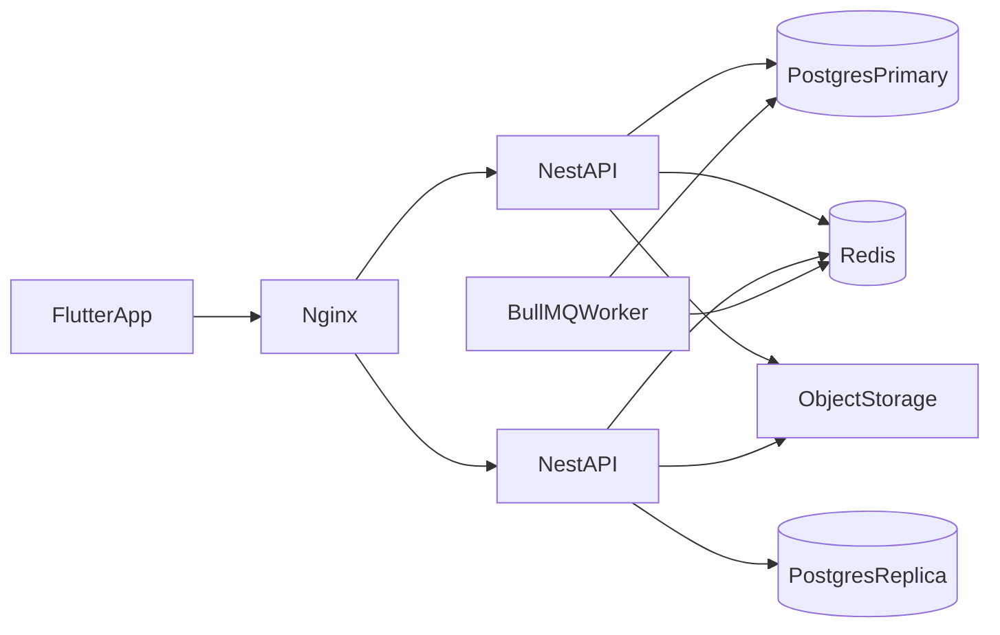

# InternFinder — Architecture

แบบระบบของแอปฝึกงาน InternFinder ยึด [REQUIREMENTS.md](REQUIREMENTS.md) เป็นขอบเขตฟีเจอร์ รายละเอียดตารางอยู่ใน [DATABASE.md](DATABASE.md)

สถานะตอนนี้ในรีโปคือสแคฟโฟลด์: NestJS ที่ `server/src` และ Flutter ที่เปิด `HomeScreen` ตรงจาก `client/lib/main.dart` เอกสารนี้คือแบบที่โค้ดใหม่ต้องเดินตาม

## 1. ภาพรวม

แอปมือถือ Flutter เรียก REST API ของ NestJS ผ่าน Nginx ตัว API ไม่เก็บ session และไม่เก็บไฟล์บนดิสก์ของตัวเอง

- ข้อมูลจริงอยู่ใน PostgreSQL
- Resume PDF และ logo อยู่ใน MinIO
- Redis ใช้เป็น cache, คิว, pub/sub และล็อกระยะสั้น
- HTTP adapter คือ Express ไม่ใช้ Fastify
- สัญญาของ API คือ Swagger ที่ `GET /api/docs`


```mermaid
flowchart LR
  app[FlutterApp] --> nginx[Nginx]
  nginx --> api1[NestAPI]
  nginx --> api2[NestAPI]
  api1 --> primary[(PostgresPrimary)]
  api2 --> replica[(PostgresReplica)]
  api1 --> redis[(Redis)]
  api2 --> redis
  worker[BullMQWorker] --> redis
  worker --> primary
  api1 --> minio[ObjectStorage]
  api2 --> minio
```

เครื่องพัฒนาใน `docker-compose.yml` รัน API, PostgreSQL, Redis และ MinIO อย่างละหนึ่งตัว Production profile เพิ่ม Nginx, PostgreSQL replica และ Redis หลายโหนด โค้ดใช้ TypeORM replication กับ JWT ที่ไม่ผูกเครื่อง ดังนั้นเพิ่มอินสแตนซ์ได้โดยไม่เปลี่ยนกติกาธุรกิจ

Read ของ job feed ชี้ replica Write ทุกชนิดชี้ primary

## 2. ทำไมใช้ Express

ใช้ `@nestjs/platform-express` ที่มีอยู่ใน `server/package.json` แล้ว Swagger ใน `server/src/main.ts` ทำงานบน Express อยู่แล้ว

- อัปโหลด Resume และ logo ใช้ `FileInterceptor` กับ multipart ซึ่งเป็นเส้นทางมาตรฐานของ NestJS บน Express
- Bull Board และ `@nestjs/terminus` เข้ากับ Express โดยไม่ต้องเขียนอะแดปเตอร์เพิ่ม
- คอขวดของแอปนี้อยู่ที่ PostgreSQL, Redis และไฟล์ ไม่ได้อยู่ที่ตัวรับ HTTP

ไม่ย้ายไป `@nestjs/platform-fastify`

## 3. Swagger

คง OpenAPI ที่ `GET /api/docs` เอกสารต้องตรงกับ route จริง ชื่อเอกสารคือ InternFinder API และมี Bearer auth

- แยก tag ตามโมดูล: Auth, Students, Companies, Provinces, Jobs, Applications, Notifications, Health
- DTO ทุกตัวมี `@ApiProperty` รวม enum และฟิลด์ที่ required
- endpoint ทุกตัวมี `@ApiOperation` และ `@ApiResponse` ของสถานะที่ใช้จริง เช่น 200, 201, 400, 401, 403, 409
- endpoint ที่ต้อง login มี `@ApiBearerAuth`
- อัปโหลด Resume และ logo ระบุว่าเป็น `multipart/form-data`
- ฝั่ง Flutter เรียกเฉพาะเส้นทางที่มีใน Swagger นี้

Prefix ของ API คือ `/api` ตาม `app.setGlobalPrefix('api')` ใน `server/src/main.ts`

## 4. โมดูล NestJS

โมดูลละหนึ่งขอบเขตธุรกิจ ไม่มีโมดูล Admin

| โมดูล | หน้าที่ |
|---|---|
| AuthModule | สมัคร, login, refresh, logout, forgot/reset password |
| StudentsModule | โปรไฟล์นักศึกษาและ Resume |
| CompaniesModule | โปรไฟล์บริษัท, logo, จังหวัดและที่อยู่สั้น, ตัวเลขแดชบอร์ด |
| ProvincesModule | มาสเตอร์จังหวัด 77 จังหวัดและชื่อเรียก |
| UniversitiesModule | ค้นหามาสเตอร์สถาบันอุดมศึกษาไทยด้วยชื่อเต็มและ aliases |
| MajorsModule | ค้นหามาสเตอร์สาขายอดนิยมเพื่อใช้เป็นคำแนะนำ |
| JobsModule | ประกาศ, feed, บันทึกงาน, เปิดหรือปิดรับสมัคร |
| ApplicationsModule | สมัครงาน, timeline, เปลี่ยนสถานะ |
| NotificationsModule | แจ้งเตือนในแอปและ BullMQ worker |
| StorageModule | พอร์ตเก็บไฟล์ ตัวจริงคือ MinIO |
| HealthModule | liveness และ readiness |

Controller บาง: รับ DTO, เรียก service, คืนค่า ไม่ใส่กติกาธุรกิจใน controller

Service ถือกติกา เช่น สมัครได้ครั้งเดียว, ทางเดินสถานะ, บริษัทเห็นเฉพาะงานของตัวเอง

Repository เป็น Data Mapper ใช้คลาส repository ที่ฉีดเข้า service ห้ามให้ entity เรียก `.save()` เองแบบ Active Record

Dependency injection เป็น singleton เป็นค่าเริ่มต้น ไม่ใช้ request scope เพราะทำให้ dependency ทั้งสายกลายเป็นต่อ request ผู้ใช้ปัจจุบันมาจาก `JwtAuthGuard` ผ่าน `@CurrentUser()` Custom provider ใช้กับ storage driver และค่า TTL ของ cache

Validation เป็น global `ValidationPipe` แบบ `whitelist`, `forbidNonWhitelisted`, `transform` แยก DTO ของการสร้างงาน, แก้งาน, ค้นหา feed, สมัครงาน และเปลี่ยนสถานะ

เทสใช้ Vitest กับ `@nestjs/testing` mock repository แบบ Arrange, Act, Assert เคสขั้นต่ำคือสมัครซ้ำ, เปลี่ยนสถานะข้ามขั้น, และบริษัทเห็นเฉพาะผู้สมัครของตัวเอง

โครงโฟลเดอร์เป้าหมาย:

```text
server/src/
├── main.ts
├── app.module.ts
├── common/
│   ├── decorators/
│   ├── filters/
│   ├── guards/
│   └── interceptors/
├── config/
├── database/
│   └── migrations/
├── auth/
├── students/
├── companies/
├── provinces/
├── jobs/
├── applications/
├── notifications/
├── storage/
└── health/
```

แต่ละโมดูลธุรกิจมี `*.module.ts`, `*.controller.ts`, `*.service.ts`, `*.repository.ts`, `dto/`, `entities/`

## 5. เส้นทาง API

Filter ของหน้า Home เป็น query ของ `GET /jobs` ไม่มี resource แยก

จังหวัดที่ใช้ในโปรไฟล์บริษัท ฟอร์มประกาศ และตัวกรองงานอ้างอิงมาสเตอร์ 77 จังหวัดเดียวกัน ชื่อจังหวัดในประกาศยังเป็นอิสระจากโปรไฟล์บริษัท

### จังหวัด

| Method | Path | ใช้กับหน้า |
|---|---|---|
| GET | /api/provinces | Company Profile, Create / Edit Job, Filter |

ผลลัพธ์มีรหัสจังหวัด ชื่อมาตรฐาน และชื่อเรียกที่ค้นหาได้ ไม่เรียกบริการค้นหาที่อยู่ภายนอก

### มหาวิทยาลัย

| Method | Path | ใช้กับหน้า |
|---|---|---|
| GET | /api/universities?q=... | Student Profile |

`q` ไม่บังคับ ยาวได้ไม่เกิน 100 ตัวอักษร; ค่าว่างคืนรายชื่อทั้งหมดเรียงชื่อไทย ค้นได้ทั้งชื่อและ aliases แบบไม่แยกตัวพิมพ์ใหญ่เล็กและละช่องว่าง/จุดเพื่อรองรับตัวย่อ เช่น `ม.อ.` และ `PSU`. ผลเป็น array ของ `{ id, nameTh }` และเปิดดู schema ได้ใน Swagger `/api/docs`.

### Auth

| Method | Path | ใครเรียก |
|---|---|---|
| POST | /api/auth/register | ยังไม่ login |
| POST | /api/auth/login | ยังไม่ login |
| POST | /api/auth/google | ยังไม่ login; ยืนยัน Google ID token และสมัคร/เข้าสู่ระบบ |
| POST | /api/auth/refresh | มี refresh token |
| POST | /api/auth/logout | login แล้ว |
| POST | /api/auth/forgot-password | ยังไม่ login, ส่ง email เพื่อขอลิงก์ |
| POST | /api/auth/reset-password | มีลิงก์ token ที่ยังไม่หมดอายุ |

Register รับ email/password หรือ Google ID token และ role student/company. role เปลี่ยนทีหลังไม่ได้.

Google sign-in ใช้ POST /api/auth/google รับ { idToken, role? }. Backend ตรวจลายเซ็น, issuer, expiry, audience allowlist, sub, email และ email_verified ด้วย Google Auth Library. จำกัด endpoint นี้ 10 ครั้งต่อนาทีต่อ client IP ด้วย NestJS throttler. Google identity ผูกด้วย (provider, provider_subject) ไม่ใช่ email. บัญชีเดิมที่ผูก sub แล้วได้ session เดิม; ถ้า email ตรงบัญชี password ให้ตอบ 409 และไม่ผูกให้อัตโนมัติ. บัญชีใหม่ที่ไม่ส่ง role ตอบ 200 { code: role_required } โดยไม่สร้างข้อมูล; ส่ง role student/company แล้วสร้าง user, provider identity และ profile ใน transaction เดียว ก่อนออก session ปกติ. ถ้าชน unique ระหว่างสร้าง ให้ค้น identity/email ใหม่และตอบผลเดิมอย่างปลอดภัย.

AuthService ตรวจรหัสผ่านตอนสมัคร: อย่างน้อย 8 Unicode code points ไม่เกิน 72 ไบต์ UTF-8 และมีตัวอักษรอังกฤษ A-Z, a-z, ตัวเลข 0-9 และอักขระพิเศษ ASCII อย่างน้อยประเภทละ 1 ตัว (ช่องว่างและ emoji ไม่นับเป็นอักขระพิเศษ) Flutter แสดงเช็กลิสต์ขณะพิมพ์และตรวจยืนยันรหัสผ่านตรงกัน กติกานี้ไม่เปลี่ยนการ login ของบัญชีเดิมหรือ reset password

Access token อายุสั้น Refresh token หมุนทุกครั้งที่ใช้ และเก็บเป็นค่า hash Logout คือเพิกถอน refresh token

Password recovery รองรับอีเมลที่ใช้สมัครของ Student และ Company ทุกโดเมน DTO และ PasswordRecoveryService ตรวจรูปแบบอีเมล ไม่ตรวจโดเมนตอนขอลิงก์หรือตอนใช้ token อีเมลรูปแบบถูกต้องได้คำตอบเดียวกันไม่ว่าบัญชีมีอยู่หรือไม่ ระบบส่งลิงก์ไปยังอีเมลที่บันทึกไว้ด้วย SMTP ลิงก์เปิด `GET /reset-password` ที่ origin ของ API นี้ เป็นหน้า HTML นอก prefix `/api` และไม่อยู่ใน Swagger token อยู่ท้าย fragment แล้วหน้าเว็บเรียก `POST /api/auth/reset-password` เก็บเฉพาะ SHA-256 ของ token ใน PostgreSQL ใช้ได้ครั้งเดียวภายใน 15 นาที รีเซ็ตรหัสผ่านและเพิกถอน refresh token ใน transaction เดียวใต้ user/token lock พร้อมเพิ่ม `users.token_version` เพื่อยกเลิก access token เดิมทันที ไม่ขึ้นกับ Google Login รายละเอียด SMTP อยู่ใน [PASSWORD_RECOVERY.md](PASSWORD_RECOVERY.md)

### นักศึกษา

| Method | Path | ใช้กับหน้า |
|---|---|---|
| GET, PATCH | /api/students/me | Student Profile |
| POST | /api/students/me/resume | Resume Upload |
| GET | /api/students/me/resume/file | Resume Preview / Download |
| GET | /api/students/me/documents | รายการเอกสาร |
| POST | /api/students/me/documents/cv | อัปโหลด/แทนที่ CV (multipart/form-data, PDF, 10 MiB max) |
| POST | /api/students/me/documents/transcript | อัปโหลด/แทนที่ transcript (multipart/form-data, PDF, 10 MiB max) |
| POST | /api/students/me/documents/other | เพิ่มเอกสารอื่น (multipart/form-data, PDF, สูงสุด 3, 10 MiB max) |
| DELETE | /api/students/me/documents/:id | ลบ CV, transcript หรือเอกสารอื่น; CV ที่ถูกใช้สมัครงานแล้วจะคงไฟล์ snapshot ของใบสมัครไว้ |
| GET | /api/students/me/documents/:id/file | เปิดเอกสารของตัวเอง |
| GET | /api/jobs | Home / Job Feed |
| GET | /api/jobs/:id | Job Detail |
| GET | /api/jobs/:id/company-logo | โลโก้บริษัทบนฟีด รายละเอียดงาน และ Saved Jobs เฉพาะประกาศที่เปิดรับและนักศึกษาที่ login แล้ว |
| GET | /api/jobs/:id/company-cover | รูปหน้าปกบริษัทบนรายละเอียดงาน เฉพาะประกาศที่เปิดรับและนักศึกษาที่ login แล้ว |
| POST, DELETE | /api/jobs/:id/save | Save จาก Job Detail |
| GET | /api/jobs/saved | Saved Jobs |
| POST | /api/jobs/:id/applications | Apply Job |
| GET | /api/applications | My Applications |
| GET | /api/applications/:id | Application Detail |
| GET | /api/notifications | Notifications |
| GET | /api/notifications/stream | ช่อง SSE ของแจ้งเตือน |

`GET /api/jobs` รับ `search`, `province`, `workMode`, `category` จากรายการเดียวกันกับตอนสร้างประกาศ, `hasAllowance`, `skills` (กรองด้วย PostgreSQL array overlap operator) และคืนเฉพาะงานสถานะ `open` ถ้าประกาศมีเบี้ยเลี้ยงต้องมี `allowanceAmount` เป็นบาท

`PATCH /api/students/me` รับ `universityId` หรือ `customUniversityName` อย่างใดอย่างหนึ่ง. ละสองฟิลด์ไว้เพื่อคงเดิม, ส่งทั้งคู่ `null` เพื่อล้างค่า; response คืนสองฟิลด์นี้และ `university` ที่ derive เป็นชื่อเต็มสำหรับแสดง.

สาขาใช้รูปแบบเดียวกัน: `GET /api/majors?q=...` คืนคำแนะนำ และ PATCH รับ `majorId` หรือ `customMajorName`; ส่งทั้งคู่ `null` เพื่อล้างค่า. response คง `major` เป็นชื่อสำหรับแสดงผล.

ค่า `province` และชื่อจังหวัดที่บันทึกในประกาศถูกแปลงเป็นชื่อมาตรฐานเดียวกันก่อนกรอง เพื่อรองรับชื่อเรียกอย่าง `กทม.` และข้อมูลเก่าอย่าง `กรุงเทพฯ`

Route `GET /api/jobs/saved` ต้องประกาศก่อน `GET /api/jobs/:id` เพื่อไม่ให้คำว่า `saved` ถูกจับเป็น id

`GET /api/jobs/:id` join โปรไฟล์บริษัทล่าสุดและคืน `companyWebsiteUrl`, `companyContactLinks`, `companySize`, `companyPerks`, `companyLocation`, `companyLogoAvailable`, `companyCoverAvailable` ร่วมกับชื่อ ประเภทกิจการ คำอธิบาย `createdAt` และ `deadline` ไม่เปิดเผย object key ของโลโก้หรือรูปหน้าปกให้นักศึกษา โหลดไฟล์ผ่านเส้นทางประกาศที่ตรวจ role และสถานะงานก่อนอ่าน storage รองรับ PNG/JPEG/WEBP/GIF/SVG และคืน 404 เมื่อไม่มีไฟล์ งานปิดแล้วไม่สามารถใช้เส้นทางนี้ได้

Flutter โหลดรายละเอียดใหม่เมื่อกลับมาเปิดหน้าและโหลดโลโก้ด้วย Dio ที่มี token ไม่ใช้ URL รูปแบบสาธารณะหรือเพิ่มหน้าโปรไฟล์บริษัท แสดงตัวอักษรชื่อบริษัทแทนเมื่อไม่มีโลโก้หรือโหลดล้มเหลว; SVG แสดงด้วย `flutter_svg`

### บริษัท

| Method | Path | ใช้กับหน้า |
|---|---|---|
| GET | /api/companies/me/dashboard | Company Dashboard |
| GET, PATCH | /api/companies/me | Company Profile |
| POST | /api/companies/me/logo | อัปโหลด logo |
| GET, POST | /api/company/jobs | Manage Jobs, Create Job |
| GET, PATCH, DELETE | /api/company/jobs/:id | อ่านรายละเอียดประกาศของบริษัทนี้พร้อมจำนวนผู้สมัคร ใบรอตรวจ และวันปิดรับ, แก้ หรือลบ |
| PATCH | /api/company/jobs/:id/status | เปิดหรือปิดรับสมัคร |
| GET | /api/company/jobs/:id/applications | Applicants List |
| GET | /api/company/jobs/:id/applications/:applicationId | Applicant Detail |
| GET | /api/company/jobs/:id/applications/:applicationId/documents/:documentId/file | เปิด CV snapshot หรือเอกสารปัจจุบัน |
| GET | /api/company/jobs/:id/applications/:applicationId/resume | เปิด PDF สำเนาของใบสมัครในแอป เฉพาะบริษัทเจ้าของประกาศ |
| PATCH | /api/company/jobs/:id/applications/:applicationId/status | เปลี่ยนสถานะผู้สมัคร |

บริษัทเรียกได้เฉพาะประกาศและผู้สมัครของบริษัทตัวเอง ไม่เช่นนั้นตอบ 403

เส้นทาง Resume ตรวจ role บริษัท เจ้าของประกาศ และคู่ job/application ใน ApplicationsService ก่อนอ่าน storage จากคีย์ของใบสมัคร ไม่อ่าน Resume ล่าสุดจาก Student Profile ส่ง application/pdf แบบ inline พร้อม private, no-store และ nosniff; ไม่มีไฟล์ตอบ 404 และ storage ล้มเหลวตอบ 503 โดยไม่เปิดเผยรายละเอียดภายใน Flutter เปิด modal PDF อ่านอย่างเดียวโดยใช้ Dio พร้อม token ไม่เรียกเส้นทาง Resume ของนักศึกษา และยังอยู่หน้ารายละเอียดหลังปิดหรือโหลดล้มเหลว

`GET /api/companies/me/dashboard` คืน `totalJobs`, `openJobs`, `totalApplicants` และ `pendingApplicants`. CompaniesService กำหนดสถานะรอตรวจเป็น `submitted` และ `reviewing`; repository นับใบสมัครผ่านประกาศของบริษัทนี้เท่านั้น รวมประกาศที่ปิดแล้วและไม่นับ timeline ซ้ำ. รายการประกาศของบริษัทใช้คำว่า `pendingApplicantCount` ในความหมายเดียวกัน. ไม่มีข้อมูลเป็น 0; query ล้มเหลวไม่แทนด้วย 0. Flutter แสดงตัวเลขเป็นสรุป แล้วแสดงประกาศที่รอตรวจกับฉบับร่างหรือประกาศที่ครบกำหนดภายใน 7 วันหรือเลยกำหนด เปิดหน้าใหม่โหลดใหม่ ดึงลงเพื่อ refresh และลองใหม่ได้เมื่อเกิดข้อผิดพลาด.

`PATCH /api/companies/me` รับ `provinceId` และ `location` (ที่อยู่สั้น) ไม่รับพิกัดสำนักงาน

`PATCH /api/companies/me` บันทึกเว็บไซต์ ช่องทางติดต่อ ขนาดองค์กร สวัสดิการ และที่อยู่ด้วยคอลัมน์เดิม เว็บไซต์ตรวจใน CompaniesService: ว่างได้ หรือ URL HTTP/HTTPS แบบเต็มที่ไม่มี credentials ค่าไม่ถูกต้องคืน 400 พร้อมเหตุผลโดยไม่บันทึกข้อมูลส่วนอื่น ช่องทางติดต่อเป็น jsonb ไม่เกิน 8 รายการ ประเภท `phone` `email` `line` `linkedin` `facebook` `instagram` `other` รายการว่างล้างค่าได้ ค่าไม่ถูกต้องไม่บันทึก Swagger ระบุฟิลด์และกติกานี้ที่ `/api/docs`

### Health

| Method | Path | ความหมาย |
|---|---|---|
| GET | /api/health/live | โปรเซสยังทำงาน |
| GET | /api/health/ready | ต่อ PostgreSQL และ Redis ได้ |

ใช้ `@nestjs/terminus` Nginx ใช้ readiness ก่อนส่งทราฟฟิก

## 6. Redis และคิว

ใช้ Redis เฉพาะจุดที่อ่านหนักหรือต้องกันการกดซ้ำ ไม่ cache สถานะใบสมัคร, แจ้งเตือน หรือ session

### Job feed เป็น cache-aside

คีย์รวม hash ของคำค้น, ตัวกรอง และเลขเวอร์ชันของ feed TTL ประมาณ 60 วินาทีบวก jitter เพื่อไม่ให้คีย์หมดอายุพร้อมกัน

ถ้า cache ไม่มี ใช้ `SET key NX EX` ให้ตัวเดียวไปอ่านฐานข้อมูล ตัวอื่นรอค่าที่ถูกเติม เป็นการกัน cache stampede

เมื่อสร้าง แก้ หรือปิดงาน ให้ `INCR jobs:feed:version` คีย์เก่าหลุดเองตาม TTL ไม่ลบคีย์ feed ทั้งก้อน

### แดชบอร์ดเป็น write-through

API แดชบอร์ดปัจจุบันอ่านจำนวนจาก PostgreSQL โดยตรงทุก request ไม่ใช้ Redis counter; แผน write-through ด้านล่างเป็นแนวทางในอนาคตและต้องไม่ทำให้ยอดรอตรวจค้างหลังเปลี่ยนสถานะ.

ตอนสร้างประกาศหรือมีใบสมัครใหม่ ให้ `INCR` ตัวเลขของบริษัทนั้นใน Redis คู่กับการเขียน PostgreSQL ถ้า Redis หาย ให้สร้างตัวเลขใหม่จากฐานข้อมูล แหล่งความจริงคือ PostgreSQL

### กันสมัครซ้ำ

`SET NX EX` ที่คู่ student กับ job กันการกดซ้ำข้ามอินสแตนซ์ Unique index ในฐานข้อมูลยังเป็นตัวตัดสินสุดท้าย

Redlock ใช้ล็อกชุดเดียวกันนี้เมื่อ production มี Redis หลายโหนด เครื่องพัฒนาใช้ Redis ตัวเดียว จึงใช้ `SET NX EX`

### แจ้งเตือนผ่าน outbox และ BullMQ

การเปลี่ยนสถานะ commit ทั้งใบสมัคร, timeline และแถว outbox ใน transaction เดียว Worker ของ BullMQ ค่อยสร้างแจ้งเตือน ถ้า Redis ล่มระหว่าง request แถว outbox ยังอยู่ใน PostgreSQL

- retry แบบ exponential backoff
- เกินจำนวนครั้งแล้วเข้า dead letter queue
- จำกัด concurrency และ rate ของ worker
- Bull Board เปิดในเครื่องพัฒนาสำหรับดูคิว

พอ worker เขียนแจ้งเตือนแล้ว publish Redis pub/sub ที่ช่องของ user นั้น API ทุกตัวที่ถือ SSE ของนักศึกษาคนนั้นส่งต่อได้โดยไม่ต้อง sticky session แหล่งความจริงที่หน้า Notifications ยังเป็น `GET /api/notifications` ไม่ใช้ push นอกแอป

## 7. กติกาที่อยู่ใน service

สมัครงานได้เมื่อนักศึกษามี Resume แล้ว งานยัง `open` และยังไม่เคยสมัครงานนี้ ใบสมัครใหม่ได้สถานะ `submitted` พร้อม event แรก

ทางเดินสถานะมีทิศทางเดียว

```text
submitted → reviewing → accepted
                      → rejected
```

`accepted` และ `rejected` เปลี่ยนต่อไม่ได้ ทุกครั้งที่บริษัทเปลี่ยนสถานะ นักศึกษาได้แจ้งเตือนหนึ่งรายการ

รายละเอียด lock และ transaction อยู่ใน [DATABASE.md](DATABASE.md)

Profile update ตรวจว่าเลือก ID ที่มีอยู่จริงหรือชื่อ custom ที่ trim แล้วอย่างใดอย่างหนึ่ง; database บังคับ FK และ CHECK constraint ซ้ำอีกชั้น. Applicant list/detail คืนชื่อมหาวิทยาลัยปัจจุบันที่ resolve จาก master/custom.
สาขาก็ตรวจ master ID/custom แบบ exclusive ที่ service และ database; Applicant list/detail resolve ชื่อจาก master หรือ custom เช่นเดียวกัน.

## 8. Flutter

ใช้ Material 3 จาก [client/lib/core/theme/app_theme.dart](../client/lib/core/theme/app_theme.dart) ไม่ลง `shadcn_ui` เพราะชุดนั้นเป็นคนละ design system และทับธีมที่มีอยู่ หน้าลิสต์ ฟอร์ม Bottom Sheet และแถบนำทางใช้ widget ของ Material

แพ็กเกจที่ลงใน `client/pubspec.yaml`

- `flutter_riverpod` ฉีด dependency และถือ state
- `go_router` นำทางและตัดสินเส้นทางจาก token
- `dio` เรียก API
- `flutter_secure_storage` เก็บ access token และ refresh token
- google_sign_in ขอ Google ID token บน Android; Web ใช้ GIS-rendered button และ client ID ใน web/index.html
- `file_picker` เลือก Resume PDF และ logo

ไม่ใช้ GetX, Bloc หรือ `build_runner` กติกาธุรกิจอยู่ที่ API แอปไม่มีคลาส use case แยก

โครงไฟล์เป็น feature-first ใต้ `client/lib/core` และ `client/lib/features` แต่ละฟีเจอร์แยก `presentation/`, `domain/`, `data/` Widget ไม่ยิง HTTP เอง

```text
client/lib/
├── main.dart
├── core/
│   ├── constants/api_constants.dart
│   ├── theme/app_theme.dart
│   ├── network/dio_client.dart
│   ├── network/auth_interceptor.dart
│   ├── router/app_router.dart
│   ├── router/student_shell.dart
│   ├── router/company_shell.dart
│   ├── storage/token_storage.dart
│   ├── error/app_exception.dart
│   ├── provinces/                # มาสเตอร์จังหวัดและ Bottom Sheet ที่ใช้ร่วมกัน
│   └── widgets/
│       ├── company_top_bar.dart   # แถบบนร่วมของหน้าบริษัททั้ง 6 หน้า
│       ├── job_card.dart
│       ├── status_chip.dart
│       ├── empty_state.dart
│       └── loading_view.dart
└── features/
    ├── auth/
    ├── jobs/
    ├── saved_jobs/
    ├── student_profile/
    ├── resume/
    ├── applications/
    ├── notifications/
    ├── company_dashboard/
    ├── company_profile/
    └── company_jobs/
```

แต่ละฟีเจอร์มี `presentation/screens`, `presentation/providers`, `domain/entities`, `domain/repositories`, `data/models`, `data/datasources`, `data/repositories` หน้า Filter อยู่ที่ `features/jobs/presentation/widgets/job_filter_sheet.dart` ไม่มี route ของตัวเอง

Splash ไม่ได้ยิงกติกาธุรกิจ `goRouterProvider` อ่าน session จาก `token_storage.dart` ถ้าไม่มีหรือใช้ไม่ได้ไป Login ถ้าเป็นนักศึกษาไป `/student/home` ถ้าเป็นบริษัทไป `/company/dashboard`

เชลล์นักศึกษาใน `student_shell.dart` มีแท็บ Home, Saved, Applications, Profile ไอคอนกระดิ่งไป Notifications

Route ที่ถูก push ทับเชลล์: Job Detail, Apply Job, Resume Upload, Application Detail

เชลล์บริษัทใน `company_shell.dart` มีแท็บ Dashboard, Jobs, Profile

Route ที่ถูก push: Create / Edit Job, Applicants List, Applicant Detail

ทุกหน้าของบริษัทใช้ `CompanyTopBar` เป็น `Scaffold.appBar` รวมถึงสถานะ loading/error เพื่อให้แถบบนอยู่คงที่ แสดงชื่อหน้าและป้ายบริษัท ไม่มี action แจ้งเตือน และไม่มี route `/company/notifications` หน้ารองเปิดปุ่มกลับซึ่ง pop เมื่อมีประวัติ หรือกลับไปหน้ารายการที่เกี่ยวข้องเมื่อเปิดจากลิงก์ตรง แถบบนของนักศึกษายังใช้ route `/student/notifications` ตามเดิม

Dio ใน `auth_interceptor.dart` ใส่ access token และเมื่อได้ 401 จะเรียก refresh หนึ่งครั้งก่อนล้าง session รอบโครงไฟล์นี้หน้าจอยังไม่ยิง API จริง data source โยน `AppException` จนกว่าจะต่อ endpoint

ก่อนอัปโหลด แอปต้องตรวจว่าเป็น PDF และไม่เกินขนาดที่ API กำหนด จุดเลือกไฟล์ใช้ `file_picker`

## 9. การสังเกตระบบและอิมเมจ

`server/Dockerfile` คงสองสเตจจาก `node:22-alpine` แล้วรันด้วย user ที่ไม่ใช่ root คอนเทนเนอร์เริ่มที่ `docker-entrypoint.sh` ซึ่งรัน migration ที่ค้างก่อน แล้วจึง `exec` โปรเซส API ถ้า migration ล้มเหลวคอนเทนเนอร์จบและไม่เปิดรับคำขอ

Log ใน request path เป็น JSON และมี request id ไม่ใช้ `console.log` เป็น log ของธุรกิจ

CORS เปิดให้แอปมือถือเรียกได้ตามที่มีใน `main.ts`

## 10. นอกแบบนี้

ไม่ทำแชท, นัดสัมภาษณ์, ยืนยัน email, login ด้วย social provider อื่นนอกจาก Google, ถอนใบสมัคร, หน้าโปรไฟล์บริษัทแยก, Admin, push notification นอกแอป หรือการเปลี่ยน role หลังสมัคร. Google Login รองรับ Android และ Web สำหรับทดสอบ; iOS ยังไม่อยู่ในขอบเขตนี้.
